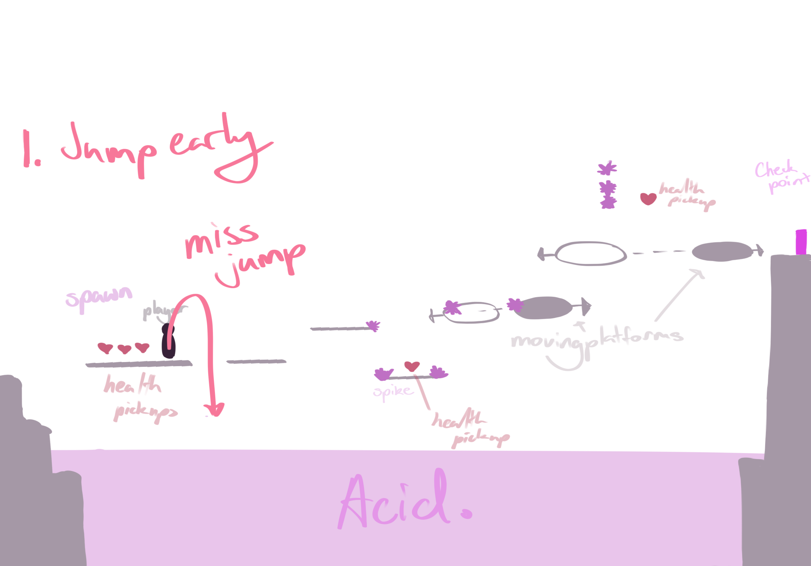
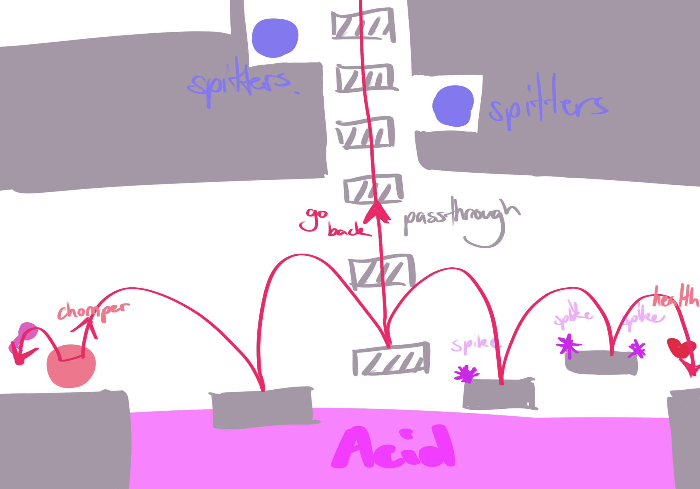

# COMP2150  - Level Design Document
### Name: [SHAWN WANG]
### Student number: [45416184] 

## 1. Player Experience (~700 words)

### 1.1. Discovery

Mechanics:

Movement:

The player learns of basic movement and inner mechanics within basic movements that are challenged throughout the level at various stages.

The player is encouraged to discover how to conduct make basic movement operations to progress in the first stages of the level. Aspects of the level that encourage this are ledges that the player must jump to in order to progress to further stages of the game. This part of the level is kept linear to guide players through applying their newly learned skills of moving left and right and also moving whilst jumping. These newly learned skills are also challenged by including spikes to inhibit complete free movement which encourages a more meditated approach to overcome theese obstacles.

This targets the design principles of an experience driven design by making movement a game in itself. Through iterative design it was found that in the early stages, moving platforms and jumping ledge to ledge was too simple for the player and their newly learned skills of movement needed to be challenged so that they can have a better control of their player. To make movement fun, the element of timing and movement control was added through the spike asset.

The spike asset also tests the player's ability to conduct basic movement and teaches them to crouch by limiting their movement if they do not wish to lose a health point.

Health:

The player is introduced to obstacles that provide the opportunity for the player to become aware of their health within the early stages of the game. The entire first stage of the level is held above an acid pool which means that if a player were to miss the collider of a platform they will fall into the acid resetting their position to the starting point of the game and losing a point of health. A health pickup is provided to the player if they succeed in overcoming the ledges and progress through the first stage of the game.

Keys/Inventory:

Once players grasp the game's basics, they're prompted to explore the environment, driven by player choice. This experience targets a player driven design as no matter which path the player takes they will end up progressing through the level. Whether advancing through jumping obstacles on the upper region or delving into the lower region of the level, each path rewards them with keys and health pickups to complete the goals of the game. All this combines to encourages further exploration to achieve goals and complete the level.

Attacking:

After completing the first stage of the game the player has now had the opportunity to practice their first learned skillset of mobility. To not overwhlem the player with too many mechanics they are spread out through separate stages of the game. They are now introduced to attacking as they approach enemies as a new obstacle to overcome. The player will pick up a staff and will be limited to clearing enemies to progress throughout the level. Here, the player is given a lot of free space to move around to space themselves between the chompers to familiarise themselves with the spacing needed to successfully hit an enemy and clear them.

In the lower region of the level the player is provided with a gun fairly early so that the player has freedom in adopting an attacking method that they prefer for most of the level. The player is presented with an opportunity to use the gun on the spitter on top of a moving platform which at some points may be unreachable by the player. Through trial and error the player will learn to recall of the crouching mechanic as the gun shoots too high to reach the spitter.

Obstacles:

The player encounters enemies to introduce them to their attacking patterns and will learn how to work around them to overcome them. The first area of the second stage of the game serves as a learning experience on how these enemies function with chompers as the players are forced to attack within melee range. They will learn that the chompers have to get closer to the player in order to deal damage to them and forces a situation where the player must practice their combat abilities to overcome them (See previous image on chompers for example).

Interactables:

As the player progresses throughout the level, they will be provided with a checkpoint where they will learn to be is their new spawning point should they fall into acid. This provides a player driven experience by exploring where they want and returning to a certain point if they decide they want to quickly return to a point where they were before.

Goal of the game:

By exploring and discovering areas of the game, the player is presented with the key door that they cannot interact with as they have not been provided with all the keys that they require to complete the level. This facilitates an experience driven design driving the player to further progress throughout the level and return to the door with a full inventory of keys to complete the goal of the game which is to explore the level, collect keys and return to the key door with a full inventory of keys.

### 1.2. Drama

In the game's first stage, simple platforms gradually challenge players' movement skills with added obstacles like spikes, testing their ability to crouch, time jumps, and control mid-air movements to avoid health loss. Checkpoints offer relief from replaying sections after falling into acid.

This experience is then shifted into simple combat where it is introduced gradually against basic enemies like chompers, allowing players to focus on mastering new mechanics without overwhelming challenges such as other obstacles experienced within the first stage of the game.

Players are rewarded with keys and health pickups throughout the game, providing relief from obstacles and enemies. The level alternates between challenges and relief moments and lastly combines previous elements into a dramatic final stage for the player.

The final stage combines various gameplay elements, including combat, movement, and obstacle navigation, increasing tension with health risks and introducing new challenges like moving platforms that have the ability to move into acid. Multiple health pickups are offered, adding risk-reward tension. Once the key is collected, players must retrace their steps to reach the key door, facing renewed tension but also reassurance from familiar challenges. If retracing steps proves difficult, respawning at the checkpoint with the key is an option.

### 1.3. Challenge

Throughout the level the player is challenged to put their newly learned skillset into use deliberately targetting certain aspects of their mechanics.

The first stage targets mobility, the second stage targets a player's ability to discover with a higher level of mobility and introduces them to attacking mechanics and the last stage of the game combines the two providing extra challenge that the player must overcome.

Within the first stage of the game, the player is introduced to the floating platforms, moving platforms and obstacles that challenge a player's ability to move while airborne, timing and other forms of movement such as crouching.

The player must avoid the spikes to avoid the consequence of losing health points and is rewarded with health pickups by doing so if they had previously failed at previous obstacles. By placing spikes on ledges and within the air, the player is limited in where they may stand, land and is challenged to crouch to retain a high health status. No enemies are encountered at this stage to avoid overwhelming the player and encourages the player to focus solely on the behaviours of the player and their surroundings.

Other main challenges are encountered when attempting to receive keys. In the higher region of the game the player is expected to practise their skill in controlled movement by jumping through passthrough platforms whilst avoiding spikes which limit the player's movement to jump as they please. This provides challenge the smaller these landing points get. I found that through iterative design that limiting the player too much may cause too many health points to be lost before making meaningful progress throughout the game and in turn, the landing spaces were largened by adjusting the position of the spikes. More health pickups were rewarded for overcoming this obstacle to compensate for its difficulty.

In the lower region of the game the player is put through the challenge of traversing through moving and pass through platforms while encountering ranged enemies that encourages a player to practise movement and timing, avoiding the spitter's projectiles whilst working their way towards a key. The player has no option to attack the spitters while on the moving platforms which provides a level of difficulty that they must overcome in order to make meaningful progress through the level. Health pickups are also provided to compensate for the difficulty of this stages and helps control the difficulty of the level as a whole.

The final stage of the game challenges overlapping mechanics of the game through obstacles and enemies. Since these elements are combined it will prove to be the most challenging stage of the game as the player is reaching the completion of the game. By incrementing difficulty in stages the player can expect that they are given indirect feedback that they are reaching further stages of the game, keeping an intuitive flow throughout the game.

### 1.4. Exploration

To learn the game's elements and core mechanics, the player is set to experience the game in a linear fashion to begin with. This is to lower the chance of building bad habits and play the game as it is intended. At the second stage of the game however, the player is encouraged to take paths that they wish so that there is an element of discovery and self fulfillment throughout the level. The player can receive keys in any order and is presented with keys to indicate to the player that by exploring the stage, they may be rewarded with progression toward the objective of the game. This presents a player driven design as the player is always right no matter the path they take, the order that they receive keys in and how they may attack enemies as they are provided with both, a gun and staff fairly early into the second stage of the level. (See storyboards in section 3 to see possible player paths)

## 2. Core Gameplay

### 2.1. Acid

Acid is introduced in the first stage of the level and is reintroduced to overlap with other mechanics to provide extra challenge to drive a higher level tension when progressing to the final stages of the level. They serve as a consequence should the player miss a landing point on a floating or moving platform to steer the player into adopting to the limits of their movement.

### 2.2. Checkpoints

Checkpoints serve as moments of relief after overcoming a certain amount of difficulties so that the player would not have to experience the same complications over and over again while progressing through the level. They are provided to the player after overcoming the first stage round of obstacles and signify the completion of the stage.

### 2.3. Chompers

Chompers are introduced after the player has familiarised themselves to their movement mechanics. No obstacles are provided in the first section of the second stage to ease the player into learning a new mechanic.

### 2.4. Health Pickups

Health pickups are provided to relieve tension in early stages of the game while players immerse themselves in learning movement. They provide a safety net to test the limitations of player movement as they are challenged with simple obstacles.

### 2.5. Keys

Keys are rewarded after overcoming a series of enemies/obstacles. They are rewarded after the player has taken the librety to explore the stage triggering their sense to explore.

### 2.6. Moving Platforms

Moving platforms are introduced after overcoming a series of still platforms in the first stage of the level. These challenge a player's jump timing to control a player's pacing in jumping.

### 2.7. Passthrough Platforms

To not overcomplicate the first stage with too many forms of obstacles, passthrough platforms are first encountered in the second stage of the level where they further challenge a player's skill in mobility.

### 2.8. Spikes

Spikes greatly increase difficulty of the level by limiting the player's movement encourage to test the limits of their movements by controlling their movements whilst airborne with intentions on aiming their character to land on a safe landing point, avoiding the consequence of colliding with the spike and losing a health point. An example of it hindering movement would be in the lower region of stage 2 where a player must conduct a short jump (quickly releasing the spacebar after jumping) to jump over the acid onto a safe landing spot to retrieve a key.

### 2.9. Spitters

Spitters are introduced deliberately after chompers as they add a new complexity of being able to shoot projectiles. Players are forced to learn their mechanics as they are unable to attack them in the lower region of the level where they have no opportunity to attack them and are forced to be prone to their attacks.

### 2.10. Weapon Pickup (Gun)

Introduced fairly shortly after receiving the staff, the gun provides an option for the player to use ranged attacks if they wish to do so. The level encourages any preferred form of combat however will prove to be easier in choosing the gun in this stage as there are many spitters which require the player to space themselves a certain distance if they do not wish to take the risk of losing health points by getting too close to their range of attacks and collision hitbox.

### 2.11. Weapon Pickup (Staff)

The staff is provided at the start of the second stage of the game to introduce the idea of attacking enemies. The player is forced into a situation against chompers where they are given enough space to distance themselves properly and learn of the features of the staff and how to successfully defeat an enemy.

## 3. Spatiotemporal Design

 
### 3.1. Molecule Diagram

### 3.2. Level Map – Section 1

### 3.3.	Level Map – Section 2

### 3.4.	Level Map – Section 3

## 4. Iterative Design

The design of the level was first aimed to introduce different player mechanics in different stages and bring them together for the final stage.

After adding simple elements and understanding that the level operated properly, challenges were then added to test the limits of the player's ability to traverse through added obstacles whilst also encountering enemies. Adding elements such as acid, spikes, moving platforms, enemies, health pickups and checkpoints after intense moments allowed me to control the flow of difficulty, tension and relief throughout the level. We can compare the difference between the two storyboard prototype examples of the initial stages of planning and the final result after making iterative development.

An example of this is the first stage of the game. Initially there were no obstacles to hinder a player's movement and were allowed to move freely, jumping ledge to ledge into the second stage of the level. It was first intended to be kept simple so that the players may familiarise themselves with jumping and moving left and right. This mechanic was repetitive and overused and the acid asset below was easily forgotten so the idea of adding obstacles to test different limits of the player was introduced through placing spikes that could damage the player. Simple spikes placed at the end of platforms were added to test the player's ability to control their movement mid-air so that they can aim themeseleves to land on a safe landing point with no spikes. If a player did collide with a spike, there was a great chance they would fall into acid and reset the player's location to the start of the level once again. This reintroduced the acid as a danger to the player and added a new level of difficulty to this stage and in turn, health pickups were added generously to compensate for the added difficulty. Moving platforms were also added as an addition to target the player's sense of timing whilst also avoiding spikes as an added difficulty. Avoiding spikes whilst also being aware of the player's position and timing was another element that kept this stage interactive retaining the player's attention to their surroundings and consequences that may follow. To target of modes of movement, spikes were added to limit a player's to jump and are instead driven to duck to avoid colliding with the spikes, teaching them of the crouch mechanic by holding the down button. Finally a checkpoint was added at the end of this stage of the level to signify progression and to relieve the player of the need to repeat the process again should they failed at some other stage reversing the progress they made thus far.Through this many different movement mechanics were exposed to the player so they experience first-hand how they utilise different modes of movement to traverse and overcome the level. It is through iterative design that we can control the flow of the game through its difficulty curve, stress and relief points.

## Generative AI Use Acknowledgement

N/A

